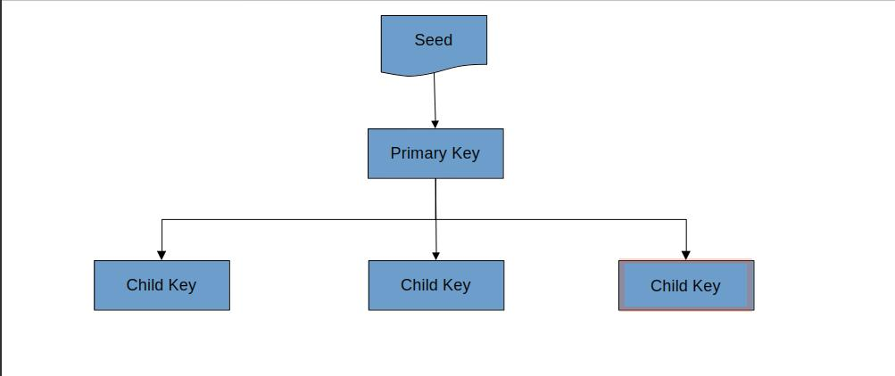

## Why TPM

- Generate security key
    - RSA, AES, ECC…
- Store security Key
    - Temporary or Permanent 
- Manage security key
    - Encrypt, import, export, migration 
- protect security key
    - Authorization, protect from attack 
- Use security key

## Hash
- https://en.wikipedia.org/wiki/Hash_function

#### Hash Extend
- https://en.wikipedia.org/wiki/Extendible_hashing

## HMAC
- https://www.okta.com/identity-101/hmac/
- https://en.wikipedia.org/wiki/HMAC

## Nonce
- https://en.wikipedia.org/wiki/Cryptographic_nonce

## KDF
- https://en.wikipedia.org/wiki/Key_derivation_function
- https://www.openssl.org/docs/man3.2/man1/openssl-kdf.html

## Symmetric & Asymmetric Algorithm
Check https://github.com/tpm2-software/tpm2-tools/blob/master/man/common/object-alg.md

## Sign with Symmetric (Use OpenSSL as example)
`openssl enc -aes-256-cbc -in un_encrypted.data -out encrypted.data`

`openssl enc -d -aes-256-cbc -in encrypted.data -out un_encrypted.data`

## Sign with Asymmetric (Use OpenSSL as example)
Ref [x2]

## Primary and Child Keys
To create keys for signing, one needs to first create a primary key under any of the 4 hierarchies. This primary key can now be used to create children keys. The children keys can now be used for signing. It is also possible for each child key of the primary key to become parent keys if it meets certain conditions. Thus one can have a deep hierarchy of keys.

The primary key cannot sign. It can only decrypt the child key for signing. This is specified by what is called key attributes. The key's attributes are set at key creation. These attributes are used to control the behaviour of the keys[0].

## Hierachy
- o for TPM_RH_OWNER
    - Permanent
    - Default   
- p for TPM_RH_PLATFORM
    - Permanent
- e for TPM_RH_ENDORSEMENT
    - Permanent 
- n for TPM_RH_NULL
    - Temporary
    - No password and policy authentication
 
Check section "14.7 Context Protection" in [X3]

## Authorization

## Authorization Formatting
Authorization for use of an object in TPM2.0 can come in 3 different forms: 
1.  Password
2.  HMAC
3.  Sessions

## Policy

## Session

## Keys
- Endorsement Key (EK)

An Endorsement Key is a special purpose TPM-resident RSA key that is never visible outside
of the TPM. Because the EK can only be used for encryption, possession of the private EK can
only be proved indirectly, by using it to decrypt a value that has been encrypted with the public
EK. Therefore, while the EK cannot be used to produce a digital signature, it is able to provide for
TPM authentication based on decryption operations. [x4]

EK cannot be used to sign data. Only thing EK can pretty much be used for is for AIK enrollment.

- Attestation key (AK)
The purpose of AKs is to sign data (e.g. PCR values) to prove that they originate from a real TPM (without having been tampered with). Remember, we cannot use the EK for signing directly.

- Attestation Identity Key (AIK)
- KEK

## Bank

## PCR

## TCTI

## Ref

[0] https://dev.to/nandhithakamal/tpm-part-1-4emf

[x1] https://stackoverflow.com/questions/16056135/how-to-use-openssl-to-encrypt-decrypt-files

[x2] https://opensource.com/article/21/4/encryption-decryption-openssl

[x3] https://trustedcomputinggroup.org/wp-content/uploads/TPM-Rev-2.0-Part-2-Structures-01.38.pdf

[x4] https://trustedcomputinggroup.org/wp-content/uploads/IWG-EK-CMC-enrollment-for-TPM-v1-2-FAQ-rev-April-3-2013.pdf

[x5] https://stackoverflow.com/questions/56561540/how-can-i-sign-data-with-the-endorsement-key-ek-of-a-tpm
